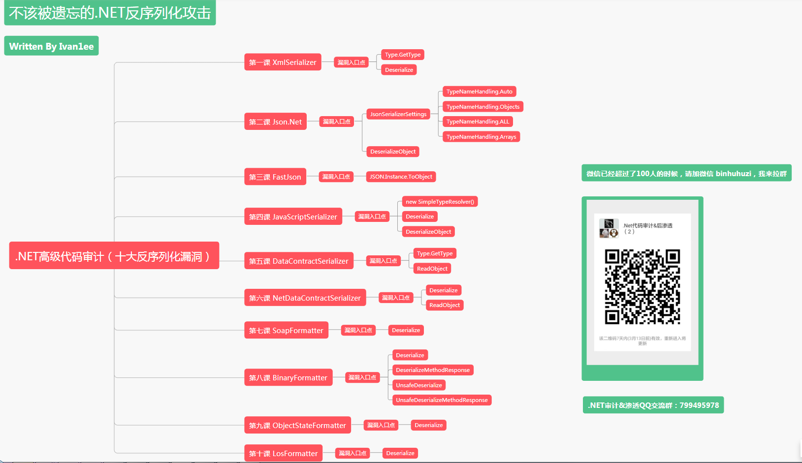

# NET-Deserialize
总结了十篇.Net反序列化文章，持续更新中...

在线阅读地址： https://ivan1ee.gitbook.io/-netdeserialize/

微信群超100人，扫码不能再加入，有兴趣的朋友可以加我微信，我来拉入群。

前段时间有朋友建议开小密圈，前天开了个.NET代码审计小密圈，纯粹技术研究，想持续的分享干货，包括基于.NET Framework（渐渐要撇开Powershell）的后渗透攻防，我会陆续邀请一些大佬做嘉宾，包括@klion 、@backlion  等资深攻防玩家，欢迎大伙加入和众多高手一起玩转.NET和后渗透。

